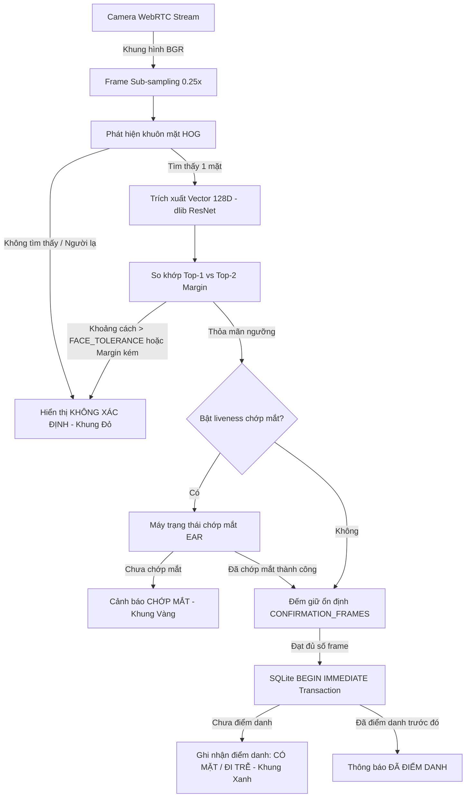
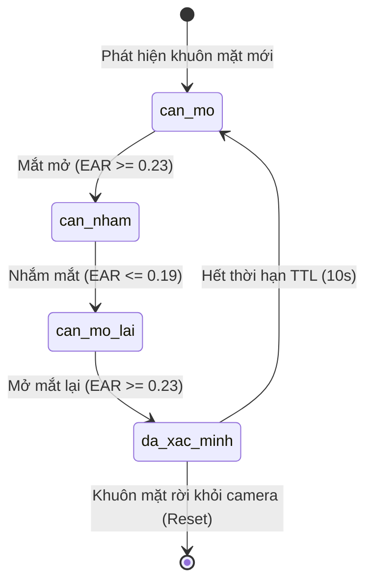
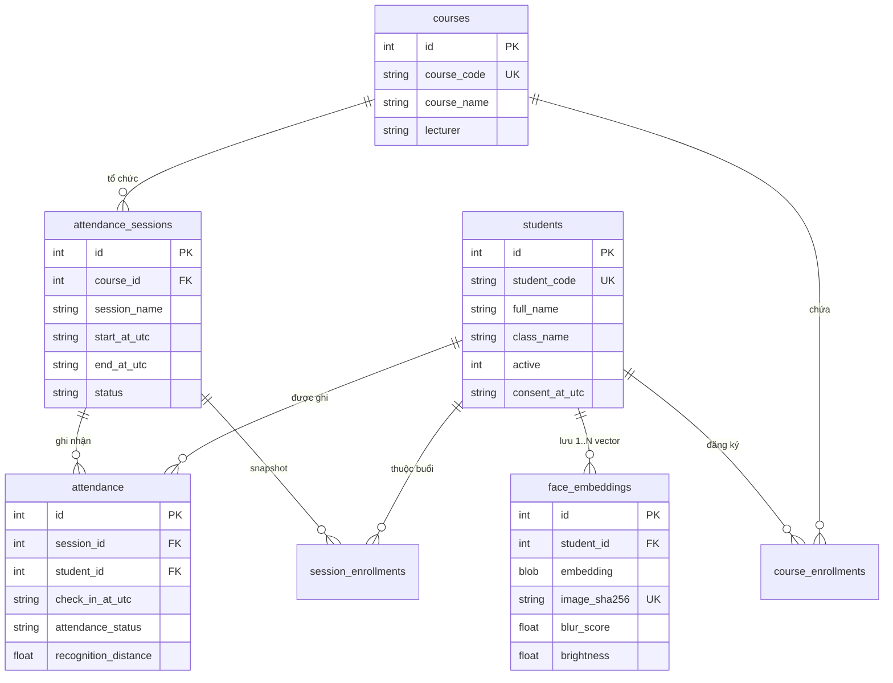

# 🎓 Face Attendance System

> **Hệ thống Điểm danh Sinh viên bằng Nhận diện Khuôn mặt thời gian thực trên Web**  
> *Được xây dựng với Python, Streamlit, WebRTC, OpenCV, dlib/face_recognition, FastAPI và SQLite.*


-003B57?logo=sqlite)


---

## 📌 1. Tổng Quan Dự Án (Project Overview)

**Face Attendance System** là giải pháp phần mềm điểm danh tự động dựa trên công nghệ **Computer Vision** và **Deep Learning**, hỗ trợ giảng viên và nhà trường quản lý điểm danh sinh viên trực tiếp qua camera trình duyệt Web (WebRTC).

Hệ thống được thiết kế theo tiêu chuẩn **Clean Architecture**, chú trọng vào **Bảo mật dữ liệu sinh trắc học (GDPR Privacy Compliance)**, **Tối ưu tốc độ xử lý khung hình (Frame Rate)**, và **Đảm bảo tính toàn vẹn dữ liệu giao dịch (ACID Transactions)** khi có nhiều lượt điểm danh song song.

---

## 🌟 2. Các Tính Năng Nổi Bật (Key Features)

| Phân loại | Chi tiết tính năng |
|---|---|
| **Đăng ký sinh viên** | • Đăng ký nhiều ảnh tham chiếu cùng lúc từ máy tính hoặc chụp camera live.<br>• Kiểm tra chất lượng ảnh tự động: phát hiện 1 khuôn mặt, độ sắc nét (Laplacian blur score), độ sáng trung bình và độ phân giải mặt tối thiểu.<br>• Không lưu ảnh gốc, chỉ lưu vector đặc trưng (128-dimensional embedding). |
| **Nhận diện Realtime** | • Xử lý camera trực tiếp trên trình duyệt qua **WebRTC**.<br>• Xử lý skip-frame và thu nhỏ ảnh (0.25x scaling) để tối ưu độ mượt FPS.<br>• Thuật toán nhận diện tập mở (Open-Set Recognition) với cơ chế từ chối người lạ (Unknown Rejection) bằng khoảng cách L2 và độ chênh lệch danh tính (Top-1/Top-2 Margin). |
| **Chống giả mạo (Anti-Spoofing)** | • Kiểm tra liveness cơ bản qua **máy trạng thái chớp mắt** (Eye Aspect Ratio - EAR).<br>• Tự động reset và thiết lập thời hạn hiệu lực (TTL) khi khuôn mặt rời khỏi camera. |
| **Quản lý & Nghiệp vụ** | • Quản lý danh sách sinh viên, môn học và danh sách sinh viên theo môn.<br>• Tạo và quản lý buổi học điểm danh với các trạng thái (`scheduled`, `open`, `closed`).<br>• Tự động phân loại trạng thái điểm danh **"Có mặt"** hoặc **"Đi trễ"** theo cấu hình thời gian. |
| **Bảo mật & Quyền riêng tư** | • Mã hóa PIN quản trị bằng **PBKDF2-HMAC-SHA256** với 240,000 vòng lặp và Salt ngẫu nhiên.<br>• Cơ chế chống Brute Force (tạm khóa 60 giây khi đăng nhập sai quá 5 lần).<br>• Bảo vệ REST API bằng khóa `X-API-Key` với so sánh hằng số thời gian chống Timing Attack.<br>• Chính sách dọn dẹp dữ liệu sinh trắc học quá hạn (Biometric Retention Policy). |
| **Báo cáo & Audit Log** | • Trích xuất báo cáo điểm danh ra file CSV (tương thích UTF-8 BOM với Microsoft Excel).<br>• Ghi nhật ký hệ thống (Audit Logs) cho tất cả thao tác quản trị và sự kiện điểm danh. |
| **RESTful API** | • Tích hợp các API FastAPI hỗ trợ Health Check, lấy danh sách buổi học, báo cáo và ghi nhận điểm danh từ thiết bị ngoại vi. |

---

## 🏗️ 3. Kiến Trúc Hệ Thống & Luồng Dữ Liệu (System Architecture)

### 3.1 Sơ đồ luồng dữ liệu điểm danh (WebRTC Pipeline)



### 3.2 Sơ đồ máy trạng thái nhận diện chớp mắt (Blink Liveness State Machine)



### 3.3 Sơ đồ Thực thể Quan hệ (ERD Database Schema)



---

## 🔬 4. Các Quyết Định Kỹ Thuật & Công Thức Toán Học (Technical Rationale)

### 4.1 Thuật toán So khớp Tập mở (Open-Set Face Recognition)
Khác với bài toán đóng (Closed-Set) mặc định gán khuôn mặt vào người gần nhất, hệ thống điểm danh cần từ chối người lạ (Unknown Rejection). Một danh tính sinh viên \(S_i\) chỉ được chấp nhận khi đạt đủ 2 điều kiện:
1. **Khoảng cách Euclidean L2 tối đa**:
   $$d(\mathbf{e}, \mathbf{e}_{S_i}) = \|\mathbf{e} - \mathbf{e}_{S_i}\|_2 \le \text{FACE\_TOLERANCE} \quad (\approx 0.50)$$
2. **Độ chênh lệch Top-1 vs Top-2 Margin**:
   $$d(S_{\text{Top-2}}) - d(S_{\text{Top-1}}) \ge \text{MIN\_IDENTITY\_MARGIN} \quad (\approx 0.05)$$
*Giải thích*: Nếu khoảng cách giữa ứng viên thứ nhất và ứng viên thứ hai quá gần nhau, nhận diện có nguy cơ mơ hồ/gán nhầm và sẽ bị hệ thống từ chối.

### 4.2 Tỉ lệ Đặc trưng Mắt (Eye Aspect Ratio - EAR)
Chỉ số EAR được tính dựa trên 6 mốc tọa độ mặt (Facial Landmarks) bao quanh mỗi con mắt:
$$\text{EAR} = \frac{\|p_2 - p_6\|_2 + \|p_3 - p_5\|_2}{2 \|p_1 - p_4\|_2}$$
- Trong đó \(p_1, p_4\) là 2 góc mắt (chiều ngang); \(p_2, p_3, p_5, p_6\) là viền mí trên và mí dưới (chiều dọc).
- Khi mắt mở bình thường: \(\text{EAR} \ge 0.23\). Khi chớp/nhắm mắt: \(\text{EAR} \le 0.19\).

### 4.3 Bảo mật Sinh trắc học & Quyền riêng tư (Privacy Compliance)
- **Non-invertible Biometrics**: Ảnh gốc chụp từ camera/upload hoàn toàn không được lưu xuống đĩa. Sau khi trích xuất vector 128 chiều (Face Embedding), ảnh gốc bị giải phóng khỏi bộ nhớ RAM.
- **Biometric Retention (TTL)**: Tự động chạy cron/lifespan task dọn dẹp các vector cũ hơn `BIOMETRIC_RETENTION_DAYS` (mặc định 365 ngày) và chuyển trạng thái hồ sơ sinh viên sang `inactive` nếu không còn mẫu tham chiếu.

### 4.4 Tính Toàn Vẹn Giao Dịch (SQLite Transaction Isolation)
- Đặt `PRAGMA journal_mode = WAL` (Write-Ahead Logging) cho phép đọc và ghi dữ liệu đồng thời.
- Thực thi `BEGIN IMMEDIATE` trong hàm `mark_attendance` để xin khóa ghi ngay từ đầu transaction, loại bỏ hoàn toàn hiện tượng điểm danh trùng (Duplicate Check-in) do Race Condition từ các client gửi song song.

---

## 💼 5. Điểm Sáng Đưa Vào CV / Portfolio (CV Highlights)

Nếu bạn đưa dự án này vào **CV/Resume** hoặc phỏng vấn tuyển dụng, đây là các từ khóa và thành tựu kỹ thuật đáng chú ý:

- **System Architecture**: Thiết kế kiến trúc phân lớp Clean Architecture mã nguồn Python 3.11+, tuân thủ nguyên lý SOLID, Type Hints & Docstring tiêu chuẩn Google Style Guide.
- **Computer Vision & Realtime Streaming**: Xây dựng pipeline xử lý luồng camera WebRTC 30+ FPS qua browser với OpenCV, dlib ResNet và Skip-frame Subsampling.
- **Anti-Spoofing & Machine Learning**: Triển khai thuật toán kiểm tra người thật (Blink Liveness State Machine) dựa trên Eye Aspect Ratio (EAR) kết hợp Open-Set Face Matching.
- **Data Engineering & Concurrency**: Thiết kế schema SQLite chuẩn hóa 3NF, cơ chế WAL mode, PRAGMA Foreign Keys và `BEGIN IMMEDIATE` transaction isolation xử lý concurrency.
- **Security & Privacy**: Mã hóa PIN chuẩn PBKDF2-HMAC-SHA256 (240k iterations), phòng chống Timing Attack trên API Key, chống Brute-force lockout và tuân thủ GDPR Biometric Retention.
- **Software Quality**: Viết bộ Unit Test & Integration Test bằng `pytest` đạt tỉ lệ **Pass 100%**, hỗ trợ Docker Containerization và FastAPI OpenAPI Specs.

---

## ⚙️ 6. Cấu Hình Biến Môi Trường (Environment Variables)

Tạo file `.env` từ `.env.example` hoặc thiết lập các biến môi trường sau:

| Biến môi trường | Giá trị mặc định | Mô tả chi tiết |
|---|---:|---|
| `FACE_ATTENDANCE_DATA_DIR` | `./face_attendance_data` | Thư mục lưu tệp SQLite `face_attendance.db`. |
| `FACE_ATTENDANCE_API_KEY` | *(Trống)* | Khóa API bí mật bắt buộc cho REST API ghi điểm danh. |
| `FACE_TOLERANCE` | `0.50` | Ngưỡng khoảng cách L2 tối đa để chấp nhận nhận diện (0.10 - 1.00). |
| `MIN_IDENTITY_MARGIN` | `0.05` | Độ chênh lệch khoảng cách tối thiểu giữa Top-1 và Top-2. |
| `PROCESS_EVERY_N_FRAMES` | `3` | Tần suất xử lý khung hình camera (bỏ qua N-1 frame). |
| `CONFIRMATION_FRAMES` | `3` | Số frame liên tiếp khớp danh tính để xác nhận. |
| `BIOMETRIC_RETENTION_DAYS` | `365` | Thời hạn lưu trữ vector khuôn mặt (ngày). |

---

## 🚀 7. Hướng Dẫn Cài Đặt & Khởi Chạy (Quick Start)

### 7.1 Yêu cầu hệ thống
- Python 3.11, 3.12 hoặc 3.13.
- Webcam và trình duyệt Web hiện đại (Chrome, Edge, Firefox).
- *Lưu ý trên Windows*: Cần cài Visual Studio C++ Build Tools nếu chưa có wheel sẵn cho `dlib`.

### 7.2 Khởi tạo môi trường ảo

#### Windows PowerShell:
```powershell
git clone <repository-url>
cd face-attendance-system
python -m venv .venv
.venv\Scripts\Activate.ps1
python -m pip install --upgrade pip
pip install -r requirements.txt
pip install -e .
```

#### Linux / macOS:
```bash
git clone <repository-url>
cd face-attendance-system
python3 -m venv .venv
source .venv/bin/activate
python -m pip install --upgrade pip
pip install -r requirements.txt
pip install -e .
```

### 7.3 Khởi chạy ứng dụng Web (Streamlit Dashboard)
```powershell
streamlit run app.py
```
Truy cập trình duyệt tại: `http://localhost:8501`

### 7.4 Khởi chạy REST API Service (FastAPI)
```powershell
uvicorn face_attendance.api:app --reload --port 8000
```
Tài liệu OpenAPI / Swagger UI khả dụng tại: `http://127.0.0.1:8000/docs`

---

## 🧪 8. Kiểm Thử & Docker (Testing & Containerization)

### 8.1 Chạy Unit Test Suite
```powershell
python -c "import os; os.makedirs('temp_pytest', exist_ok=True)"
python -m pytest --basetemp=temp_pytest -o cache_dir=temp_pytest/.pytest_cache -v
```

### 8.2 Khởi chạy với Docker
```powershell
# Build Docker image
docker build -t face-attendance-system .

# Run Container
docker run -d --name face-app -p 8501:8501 -v face_data:/app/face_attendance_data face-attendance-system
```

---

## 🌐 9. Tài Liệu REST API (API Endpoints Overview)

Khi truyền header `X-API-Key: <your_secret_key>`, hệ thống mở rộng các API:

| HTTP Method | Endpoint | Quyền hạn | Mô tả |
|---|---|---|---|
| `GET` | `/health` | Public | Kiểm tra trạng thái ứng dụng (`{"status": "ok"}`). |
| `GET` | `/sessions` | API Key | Lấy danh sách tất cả các buổi học điểm danh. |
| `GET` | `/sessions/{id}/attendance` | API Key | Lấy báo cáo kết quả điểm danh của buổi học `{id}`. |
| `POST` | `/attendance` | API Key | Ghi nhận điểm danh cho sinh viên (`session_id`, `student_id`, `recognition_distance`). |

---

## 📂 10. Cấu Trúc Thư Mục Dự Án (Project Structure)

```text
face-attendance-system/
├── app.py                      # Streamlit Dashboard main entrypoint
├── pyproject.toml              # Build & Package configuration
├── requirements.txt            # Python dependencies specification
├── Dockerfile                  # Docker build configuration
├── .env.example                # Template mẫu biến môi trường
├── README.md                   # Tài liệu dự án chi tiết
├── src/
│   └── face_attendance/
│       ├── __init__.py
│       ├── config.py           # Cấu hình biến môi trường & hằng số hệ thống
│       ├── utils.py            # Tiện ích thời gian UTC, chuẩn hóa & mã hóa PBKDF2
│       ├── database.py         # SQLite Repository layer, schema & ACID transactions
│       ├── matcher.py          # Thuật toán Open-Set Face Matching (Top-1/Top-2 Margin)
│       ├── liveness.py         # Máy trạng thái Blink Liveness (Eye Aspect Ratio)
│       ├── recognition.py      # Quality Check ảnh, WebRTC Engine & Frame Processor
│       ├── api.py              # FastAPI REST Service & OpenAPI endpoints
│       └── ui.py               # Streamlit Views & Multi-tab Admin Panel
└── tests/
    ├── test_api.py             # Unit test cho FastAPI endpoints
    ├── test_database.py        # Unit test cho SQLite transactions & reports
    ├── test_liveness.py        # Unit test cho Blink Liveness state machine
    └── test_matcher.py         # Unit test cho Open-Set face matcher
```

---

## 📄 11. Giấy Phép (License)

Dự án được phân phối dưới giấy phép **MIT License**. Bạn được tự do sử dụng, chỉnh sửa và đóng góp cho mục đích học tập, giảng dạy hoặc phát triển sản phẩm cá nhân.
